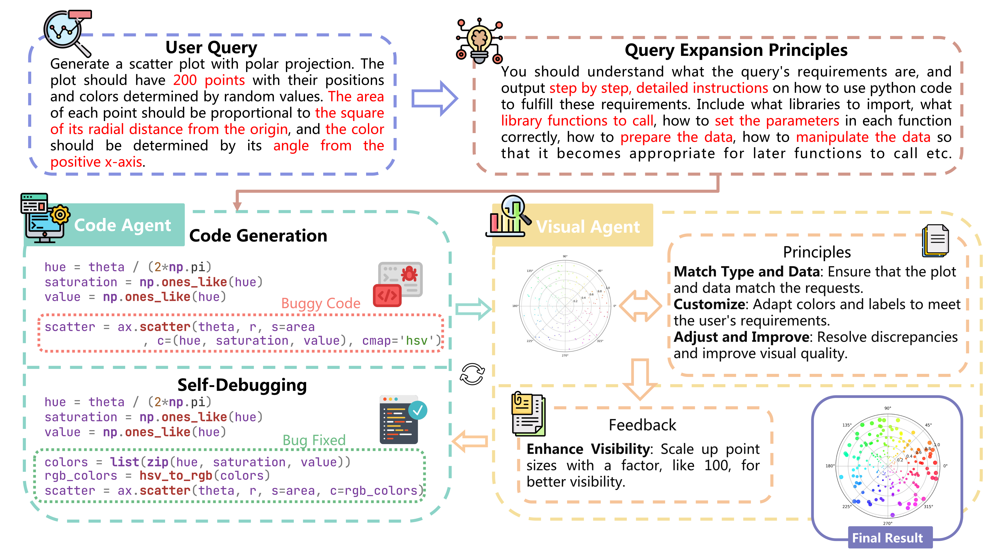
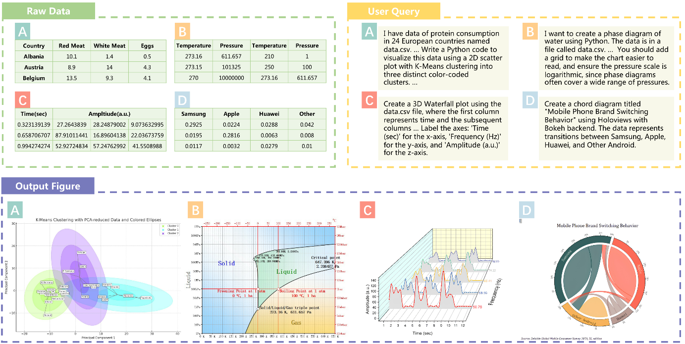
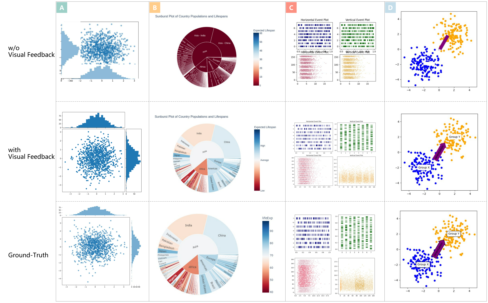
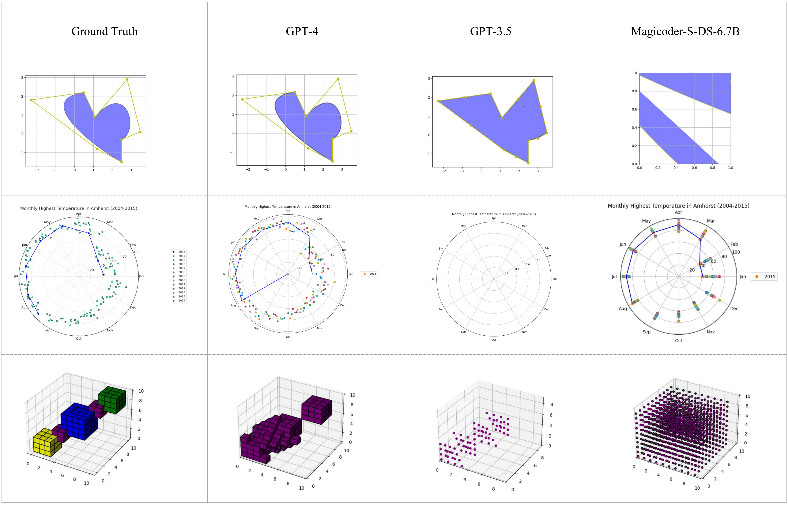

<div align="center">


**MatPlotAgent: Enhancing Scientific Data Visualization with LLMs**

<p align="center">•
 <a href="#-introduction"> 📖Introduction </a> •
 <a href="#-news">🎉News</a> •
 <a href="#-matplotagent">✨MatPlotAgent</a> •
 <a href="#-matplotbench">🎖MatPlotBench</a> 
</p>
<p align="center">•
 <a href="#%EF%B8%8F-getting-started">⚡️Getting Started</a> •
 <a href="#-experiment-results">📊Experiment Results</a> •
 <a href="#-citation">🔎Citation </a> •
 <a href="https://arxiv.org/abs/2402.11453">📃Paper</a>
</p>
</div>

# 📖 Introduction
Scientific data visualization is crucial for conveying complex information in research, aiding in the identification of implicit patterns. Despite the potential, the use of Large Language Models (LLMs) for this purpose remains underexplored. **MatPlotAgent** introduces an innovative, model-agnostic LLM agent framework designed to automate scientific data visualization tasks, harnessing the power of both code LLMs and multi-modal LLMs.

Integrating LLMs into scientific data visualization represents a new frontier in technology that supports research. Existing tools, such as Matplotlib and Origin, are challenging for many people and learning these tools is time-consuming. **MatPlotAgent** is conceived to bridge this gap, leveraging LLM capabilities to enhance human efficiency significantly. **MatPlotBench** is curated to further traction the field of AI-automated scientific data visualization by providing a comprehensive benchmark and trustworthy automatic evaluation method.

# 🎉 News

* March 7, 2024: Releasing the MatPlotAgent, an innovative and model-agnostic framework designed to revolutionize scientific data visualization by automating tasks with advanced LLMs. 🎊
* March 7, 2024: Releasing MatPlotBench, a comprehensive and meticulously curated benchmark that sets a new standard for evaluating AI-driven visualization tools. 🌟


# ✨ MatPlotAgent

  1. **Query Expansion**: Thoroughly interprets user requirements and transform them into LLM-friendly instructions
  2. **Code Generation with Iterative Debugging**: Uses code to preprocess data and generate figures, with self-debugging capabilities.
  3. **Visual Feedback Mechanism**: Employs visual perceptual abilities for error identification and correction.
  4. **Generalizability**: Demonstrated effectiveness with various LLMs, including commercial and open-source models.

<div align="center">
  
</div>

# 🎖 MatPlotBench

A high-quality benchmark of 100 human-verified test cases alongside a scoring approach utilizing GPT-4V for automatic evaluation, demonstrating strong correlation with human-annotated scores.

<div align="center">
  
</div>


# ⚡️ Getting Started

This project opensources the following components to foster further research and development in the field of scientific data visualization:

- **Benchmark Data (MatPlotBench)**: A meticulously crafted benchmark to quantitatively evaluate data visualization approaches.
- **Evaluation Pipeline**: Utilizes GPT-4V for automatic evaluation, offering a reliable metric that correlates strongly with human judgment.
- **MatPlotAgent Framework**: The entire codebase for the MatPlotAgent framework is available, encouraging adaptation and improvement by the community.

<!-- #TODO
[Instructions on how to access and use the benchmark data, evaluation pipeline, and the MatPlotAgent framework.] -->

Benchmark Data (MatPlotBench) can be found in the `./benchmark_data` folder.

The code requires some dependencies as specified in requirements.txt. Please follow the relevant libraries to install or run:

```
pip install -r requirements.txt
```


## MatPlotAgent Framework

### Configuration

If you're using the open-source model, please download the model to your local machine first and adjust the location of the corresponding model in `models/model_config.py`.

If you're using GPT-3.5 or GPT-4, please update your `API_KEY` in `agents/config/openai.py`.

### Running OpenAI-Compatible Server

If you're utilizing GPT-3.5 or GPT-4, you can skip this section.

We use vLLM to deploy the open-source model as a server, implementing the OpenAI API protocol. This enables vLLM to seamlessly replace applications using the OpenAI API.

Ensure you have vLLM installed and configured on your local machine.

We provide scripts to deploy the API server. For instance, to deploy `CodeLlama-34b-Instruct`, you can execute:

```
bash models/scripts/CodeLlama-34b-Instruct-hf.sh
```

If you need to modify the script's content, please refer to the [vLLM documentation](https://docs.vllm.ai/en/latest/index.html).

### Running MatPlotAgent Framework

To execute the MatPlotAgent framework, use the following script:

```bash
python workflow.py \
    --model_type MODEL \
    --workspace path/to/result
```

Replace `MODEL` with the desired model. All available `model_type` options can be found in `models/model_config.py`.

Replace `path/to/result` with the desired path to save the results.

The benchmark runner also supports filtering and prompt variants:

```bash
python workflow.py \
    --model_type gpt-5.4-mini \
    --workspace workspace_matplotbench_gpt54mini_capimagine_full \
    --benchmark_dir benchmark_data \
    --visual_refine true \
    --visual_refine_prompt_variant capimagine \
    --start_id 1 \
    --end_id 100
```

Useful flags:

- `--benchmark_dir`: resolves benchmark files without hard-coded local paths
- `--start_id`, `--end_id`, `--data_ids`: run subsets of MatPlotBench
- `--visual_refine_prompt_variant {default,capimagine,cap_full,cap_no_imagination,cap_no_root_cause,cap_no_revision_checklist,cap_no_preserve_correct_parts}`: switch between the original visual-refine prompt, the full CapImagine-style variant, and the ablation variants used for prompt-component studies

For reproducible experiment orchestration, use the runner:

```bash
python evaluation/final_project_runner.py manifest

python evaluation/final_project_runner.py generate \
    --model_alias gpt54mini \
    --setting default \
    --start_id 1 \
    --end_id 100 \
    --skip_existing

python evaluation/final_project_runner.py eval \
    --model_alias gpt54mini \
    --setting default \
    --eval_model gpt-5.4 \
    --score_mode combined \
    --skip_existing
```

Runner settings currently include:

- reproduction settings: `direct`, `cot`, `default`
- improvement setting: `capimagine`
- ablation settings: `cap_full`, `cap_no_imagination`, `cap_no_root_cause`, `cap_no_revision_checklist`, `cap_no_preserve_correct_parts`

For direct decoding, use:

```bash
python one_time_generate.py \
    --model_type MODEL \
    --workspace path/to/result
```

For zero-shot COT, use:

```bash
python one_time_generate_COT.py \
    --model_type MODEL \
    --workspace path/to/result
```

## Evaluation Pipeline

After running the MatPlotAgent Framework, you can utilize the Evaluation Pipeline to obtain automatic evaluation scores.

Legacy resemblance evaluation:

```bash
python evaluation/api_eval.py 17 \
    --workspace workspace_matplotbench_gpt54mini_full \
    --benchmark_dir benchmark_data \
    --direct_eval \
    --generated_model_name gpt-5.4-mini \
    --eval_model gpt-4o
```

Rubric-based evaluation in parallel with the legacy judge:

```bash
python evaluation/api_eval.py 17 \
    --workspace workspace_matplotbench_gpt54mini_capimagine_full \
    --benchmark_dir benchmark_data \
    --direct_eval \
    --generated_model_name gpt-5.4-mini_capimagine \
    --eval_model gpt-5.4 \
    --run_rubric_eval
```

Average score aggregation:

```bash
python evaluation/average_score_calc.py \
    --workspace workspace_matplotbench_gpt54mini_capimagine_full \
    --generated_model_name gpt-5.4-mini_capimagine \
    --eval_model gpt-5.4 \
    --score_type combined
```

Supported score modes:

- `legacy`: original resemblance-only judge
- `rubric`: query-conditioned rubric judge
- `combined`: weighted combination of legacy and rubric scores (`0.5 / 0.5` by default)

For merged analyses that combine a full run with hard-case reruns, use:

```bash
python evaluation/full_bucket_analysis.py \
    --default_base_workspace workspace_matplotbench_gpt54mini_full \
    --default_override_workspace workspace_low20_gpt54mini_default_rerun \
    --cap_base_workspace workspace_matplotbench_gpt54mini_capimagine_full \
    --cap_override_workspace workspace_low20_gpt54mini_capimagine_rerun \
    --eval_model gpt-4o \
    --output_path gpt54mini_full_merged_analysis_by_gpt4o.json
```

For full-vs-full bucket analysis without override reruns, omit the override workspaces:

```bash
python evaluation/full_bucket_analysis.py \
    --default_base_workspace workspace_finalproj_gpt54mini_default_full \
    --cap_base_workspace workspace_finalproj_gpt54mini_capimagine_full \
    --eval_model gpt-5.4 \
    --output_path outputs/gpt54mini_default_vs_capimagine_buckets.json
```

To build paper tables and case-study candidate lists from frozen workspaces:

```bash
python evaluation/final_project_tables.py \
    --output_dir outputs/final_project_tables

python evaluation/select_case_studies.py \
    --model_alias gpt54mini \
    --eval_model gpt-5.4 \
    --output_path outputs/gpt54mini_case_studies.json
```

## Local Repo Updates

This repository has been updated to support a more reproducible local MatPlotBench workflow:

- benchmark input copying is centralized in `matplotbench_runtime.py`
- benchmark generation scripts now accept `--benchmark_dir`, subset filters, and real model names
- `workflow.py` preserves both the original visual-refine prompt, the full CapImagine-style prompt, and ablation-friendly `cap_*` prompt variants
- `evaluation/api_eval.py` keeps the legacy resemblance judge and adds a parallel rubric-based judge
- `evaluation/final_project_runner.py` standardizes workspace naming, generated model labels, resume-safe generation, and dual-track evaluation commands
- `evaluation/final_project_tables.py` emits main-table / appendix-table artifacts in both JSON and Markdown
- `evaluation/select_case_studies.py` selects representative reproduction and default-vs-capimagine image cases from frozen runs
- `evaluation/average_score_calc.py` and `evaluation/full_bucket_analysis.py` support legacy, rubric, combined, and bucketed analysis workflows


# 📊 Experiment Results

Our experiments showcase MatPlotAgent's ability to improve LLM performance across a variety of aspects, with notable enhancements in plot quality and correctness, supported by both quantitative scores and qualitative assessments.

Performance of different LLMs on MatPlotBench. For each model, improvements over the direct decoding are highlighted in **bold**.

| Model                                         | Direct <br>Decod. | Zero-Shot <br>CoT | MatPlotAgent <br>w/ GPT-4V     |
|-----------------------------------------------|---------------|---------------|-------------------|
| **GPT-4**                                     | 48.86         | 45.42 (-3.44) | 61.16 (**+12.30**)|
| **GPT-3.5**                                   | 38.03         | 37.14 (-0.89) | 47.51 (**+9.48**) |
| **Magicoder-S-DS-6.7B** ([Wei et al.,](https://arxiv.org/abs/2312.02120))    | 38.49         | 37.95 (-0.54) | 51.70 (**+13.21**)|
| **Deepseek-coder-6.7B-instruct** ([Guo et al.,](https://arxiv.org/abs/2401.14196)) | 31.53  | 29.16 (-2.37) | 39.45 (**+7.92**)  |
| **CodeLlama-34B-Instruct** ([Rozière et al.,](https://arxiv.org/abs/2308.12950))  | 16.54         | 12.40 (-4.14) | 14.18 (-2.36)     |
| **Deepseek-coder-33B-instruct** ([Guo et al.,](https://arxiv.org/abs/2401.14196))  | 30.88  | 36.10 (**+5.22**) | 32.18 (**+1.30**)|
| **WizardCoder-Python-33B-V1.1** ([Luo et al.,](https://arxiv.org/abs/2306.08568))   | 36.94  | 35.81 (-1.13) | 45.96 (**+9.02**) |

Additionally, we present the results of using Gemini Pro Vision as the visual agent on GPT-4 and GPT-3.5, showcasing a considerable improvement of 7.87 and 5.45, respectively, over the direct decoding baseline. This evidence further demonstrates our method's model-agnostic characteristics by using various multimodal LLMs to achieve improved performance.

| Model   | Direct Decod. | MatPlotAgent<br> w/ Gemini Pro Vision|
|---------|---------------|-----------------------------------|
| GPT-4   | 48.86         |                                   56.73 (**+7.87**) |
| GPT-3.5 | 38.03         |                                   43.48 (**+5.45**) |

We assessed MatPlotAgent's performance on the visualization subset of the Code Interpreter Benchmark, which was released alongside Qwen-agent, witnessing notable improvements over GPT-4. These results underscore the efficacy of our approach in enhancing visualization capabilities.

<table>
  <thead>
    <tr>
      <th rowspan="2"><strong>Model</strong></th>
      <th colspan="3" align="center"><strong>Accuracy of Code Execution Results (%)</strong></th>
    </tr>
    <tr>
      <th align="center"><strong>Visualization-Hard</strong></th>
      <th align="center"><strong>Visualization-Easy</strong></th>
      <th align="center"><strong>Average</strong></th>
    </tr>
  </thead>
  <tbody>
    <tr>
      <td>GPT-4</td>
      <td align="center">66.7</td>
      <td align="center">60.8</td>
      <td align="center">63.8</td>
    </tr>
    <tr>
      <td><strong>+ MatPlotAgent</strong></td>
      <td align="center"><strong>72.6</strong></td>
      <td align="center"><strong>68.4</strong></td>
      <td align="center"><strong>70.5</strong></td>
    </tr>
    <tr>
       <td><em>w/o Visual Feedback</em></td>
      <td align="center">66.7</td>
      <td align="center">65.8</td>
      <td align="center">66.3</td>
    </tr>
  </tbody>
</table>


## 📈 Ablation and Case Study
Examples to illustrate the effect of visual feedback. To investigate the effect of the visual feedback mechanism on different models, we display the outputs of two representative LLMs. Case A, B, and C are generated by GPT-4. Case D is generated by Magicoder-S-DS-6.7B.
<div align="center">
  
</div>

Case study of different models
<div align="center">
  
</div>


# 🔎 Citation

Feel free to cite the paper if you think MatPlotAgent is useful.

```bibtex
@misc{yang2024matplotagent,
      title={MatPlotAgent: Method and Evaluation for LLM-Based Agentic Scientific Data Visualization}, 
      author={Zhiyu Yang and Zihan Zhou and Shuo Wang and Xin Cong and Xu Han and Yukun Yan and Zhenghao Liu and Zhixing Tan and Pengyuan Liu and Dong Yu and Zhiyuan Liu and Xiaodong Shi and Maosong Sun},
      year={2024},
      eprint={2402.11453},
      archivePrefix={arXiv},
      primaryClass={cs.CL}
}
```


